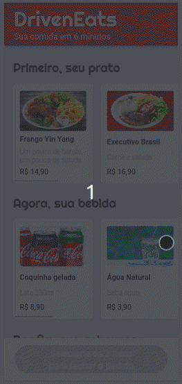

# DrivenEats

<p align="center">
  
  <a href="https://github.com/yaratavares/DrivenEats/commits/main">
    
  </a>
   </p>

<p align="center">
 <a href="#-sobre-o-projeto">Projeto</a> • <a href="#-layout">Layout</a> • 
 <a href="#-tecnologias">Tecnologias</a> • 
  <a href="#-executar">Executar</a> • 
 <a href="#-autor">Autor</a> • 
 <a href="#-licença">Licença</a>
</p>

## 💻 Projeto

DrivenEats é um site desenvolvido para mobile, nele é possível solicitar uma refeição completa em alguns segundos, somente é necessário selecionar um prato, bebida e sobremesa e assim ser redirecionado para o Whatsapp onde poderá dar prosseguimento a solicitação.

Terceiro projeto desenvolvido no curso de Full-Stack Developer na [Driven Education](https://www.driven.com.br/), desenvolvido inicialmente em HTML e JS, foi aprimorado usando React e SASS.

---

## 🎨 Layout

O layout somente para Mobile da aplicação está disponível no Figma:

<a href="https://www.figma.com/file/WImHJQlgPGpNpX5jZ9HwxW/DrivenEats-(Copy)?node-id=0%3A1">

</a>

<br/>

<p>

</p>

---

## 🚀 Como executar o projeto

Você pode somente acessar a [página](https://driven-eats-mb43kbz7p-yaratavares.vercel.app/) ou instalar na sua máquina como seguem as instruções a seguir:

### Pré-requisitos

Antes de começar, você vai precisar ter instalado em sua máquina as seguintes ferramentas:
[Git](https://git-scm.com), [Node.js](https://nodejs.org/en/).
Além disto é bom ter um editor para trabalhar com o código como [VSCode](https://code.visualstudio.com/)

#### 🧭 Rodando a aplicação web (Front-end)

```bash
# Clone este repositório
$ git clone git@github.com:yaratavares/DrivenEats.git
# Vá para a pasta da aplicação e instale as dependências
$ npm install
# Execute a aplicação em modo de desenvolvimento
$ npm run start
# A aplicação será aberta na porta:3000 - acesse http://localhost:3000
```

---

## 🛠 Tecnologias

As seguintes ferramentas foram usadas na construção do projeto:

<a src="https://reactjs.org/">
</a>

<a src="https://sass-lang.com/"></a>

> Veja o arquivo [package.json](./package.json)

---

## 🧜‍♀️ Autora

<a href="https://www.linkedin.com/in/yaracristinatavares/" >
 
 <p>Yara Tavares 🚀</p>
</a>
  
---

## 📝 Licença

Este projeto esta sobe a licença [MIT](./LICENSE).
